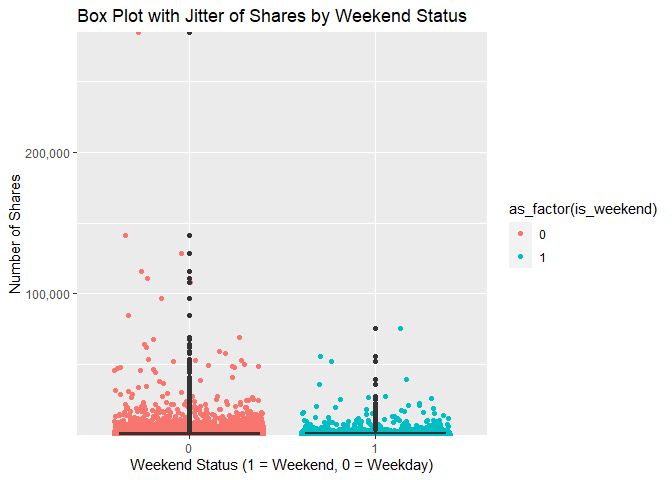
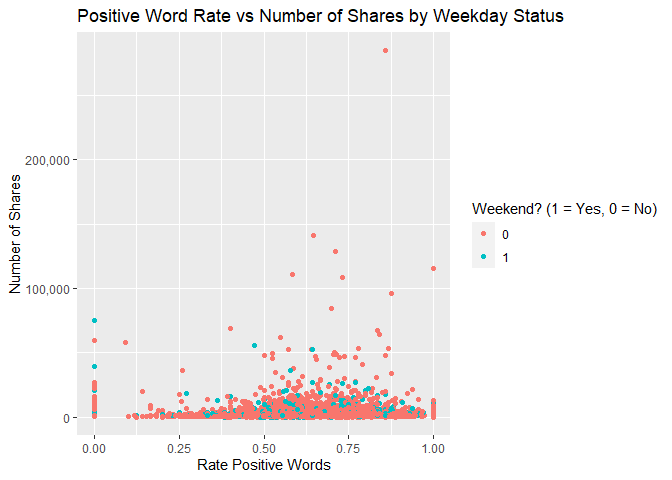

Project 2
================
Ipsita Datta & Victoria Seng
10/15/2021

## Introduction

VICTORIA TODO: describe data set and vars we are working with (target =
shares) and mention purpose of analysis methods

I’ll add more here once we get a feel for which vars we want to work
with and for our models

## Data

Importing the data and grabbing a vector of the data channels for later
use.

``` r
newsPop <- read_csv("./Data/OnlineNewsPopularity.csv")
newsChannels <- newsPop %>%
  select(starts_with("data_channel_is_")) %>%
    names
newsChannels
```

    ## [1] "data_channel_is_lifestyle"     "data_channel_is_entertainment"
    ## [3] "data_channel_is_bus"           "data_channel_is_socmed"       
    ## [5] "data_channel_is_tech"          "data_channel_is_world"

Transpose newsPop data to create pie chart across all the data channels

``` r
newsPop_TP <- newsPop %>%
  pivot_longer(starts_with("data_channel_is_"), names_to = "dc", values_to = "dcVal") %>%
    filter(dcVal == TRUE) %>%
      mutate(datachannel = substr(dc, 17, nchar(dc))) %>%
        select(datachannel,shares,-dc, -dcVal) 
```

Subsetting the data by the type of data channels :

``` r
bus <- newsPop %>%
  filter(data_channel_is_bus == TRUE) %>%
    select(-starts_with("data_channel_is_"))
```

## Summarizations

TODO: three graphs apiece and “some” summary statistics each. Let’s try
both doing a contingency table and a couple of summary stats.

I’m going to work with weekday a bit so need to transpose to make it
easier to work with.

``` r
TP <- bus %>%
  pivot_longer(starts_with("weekday_is"), names_to = "wd", values_to = "wdVal") %>%
    filter(wdVal == TRUE) %>%
      mutate(weekday = substr(wd, 12, nchar(wd))) %>%
        select(-wd, -wdVal) 
```

This contingency table shows the overall number of shares by weekday. A
higher number means more shares have happened on that day.

``` r
GDAtools::wtable(TP$weekday, w = TP$shares)
```

    ##    friday    monday  saturday    sunday  thursday   tuesday 
    ##   1966657   4482214   1075736   1215518   3560327   3466021 
    ## wednesday       Sum 
    ##   3401897  19168370

Here is the contingency table for best keywords shares by weekdays

``` r
GDAtools::wtable(TP$weekday, w = TP$kw_max_max)
```

    ##     friday     monday   saturday     sunday   thursday    tuesday 
    ##  621229600  860841600  181677500  258820700  907211600  879178400 
    ##  wednesday        Sum 
    ##  939551600 4648511000

Here is contingency table for the number of maximum shares of an article
that was linked in the article by weekday

``` r
GDAtools::wtable(TP$weekday, w = TP$self_reference_max_shares)
```

    ##    friday    monday  saturday    sunday  thursday   tuesday 
    ##   8581966  12593525   1713004   2008317  12859706  13292569 
    ## wednesday       Sum 
    ##  14414037  65463124

Here are some summary stats by weekday. Again, bigger means more shares.

``` r
TP %>%
  group_by(weekday) %>%
    summarize(min = min(shares), mean = mean(shares), median = median(shares), iqr = IQR(shares), max = max(shares))
```

    ## # A tibble: 7 x 6
    ##   weekday     min  mean median   iqr    max
    ##   <chr>     <dbl> <dbl>  <dbl> <dbl>  <dbl>
    ## 1 friday       22 2364.   1400 1420. 102200
    ## 2 monday        1 3887.   1400 1651  690400
    ## 3 saturday    150 4427.   2600 2150  144400
    ## 4 sunday      692 3544.   2200 2400   56900
    ## 5 thursday     81 2885.   1300 1297. 306100
    ## 6 tuesday      44 2932.   1300 1387  310800
    ## 7 wednesday    63 2677.   1300 1312  158900

A higher number means more best keywords tend to be shared more often by
weekday

``` r
TP %>%
  group_by(weekday) %>%
    summarize(min = min(kw_max_max), mean = mean(kw_max_max), median = median(kw_max_max), stddev=sd(kw_max_max),iqr = IQR(kw_max_max), max = max(kw_max_max))
```

    ## # A tibble: 7 x 7
    ##   weekday     min    mean median  stddev    iqr    max
    ##   <chr>     <dbl>   <dbl>  <dbl>   <dbl>  <dbl>  <dbl>
    ## 1 friday    28000 746670. 843300 220859.      0 843300
    ## 2 monday        0 746610. 843300 218158. 152900 843300
    ## 3 saturday  37400 747644. 843300 204422. 152900 843300
    ## 4 sunday    37400 754579. 843300 206016.      0 843300
    ## 5 thursday  11100 735180. 843300 231586. 152900 843300
    ## 6 tuesday   17100 743806. 843300 220836. 152900 843300
    ## 7 wednesday 17100 739222. 843300 223310. 152900 843300

Here is the pie chart showing overall which datachannel is doing best

``` r
df<-newsPop_TP %>% group_by(datachannel) %>% summarise_each(funs(sum))
pct <- round(df$shares/sum(df$shares)*100)
lbls <- paste(df$datachannel, pct) # add percents to labels
lbs<-paste(lbls,"%",sep="")
pie3D(df$shares,labels=lbs,explode=0.1,
   main="Pie Chart of Shares across datachannels ")
```

<!-- --> Here is the bar plot showing
bestkeyword shares by weekdays.Heigher means for bestkeyword shares on
that day

``` r
plot1<-ggplot(TP,aes(x=weekday,y=kw_max_max,fill=weekday))
plot1+ geom_col() + 
  scale_x_discrete("weekday") + 
  ggtitle("bestkeyword shares across weekdays")+
  scale_y_continuous(labels = scales::comma)
```

<!-- -->

``` r
plot2<-ggplot(TP,aes(x=weekday,y=shares,fill=weekday))
plot2+ geom_col() + 
  scale_x_discrete("weekday") + 
  ggtitle(" shares across weekdays")+
  scale_y_continuous(labels = scales::comma)
```

<!-- -->

Here is a boxplot of shares by weekend status. I hate how squashed it is
and need to find a way to programatically deal with outliers.

``` r
g <- ggplot(data = bus, aes(x = as_factor(is_weekend), y = shares, group = as_factor(is_weekend)))
g + geom_jitter(aes(color = as_factor(is_weekend))) +
  geom_boxplot() +
      labs(x = "Weekend Status (1 = Weekend, 0 = Weekday)", 
           y = "Number of Shares", 
           title = "Box Plot with Jitter of Shares by Weekend Status") +
        scale_y_continuous(labels = scales::comma, expand = expansion(mult = c(0,0)))
```

<!-- -->

Here is a scatter plot of shares vs positive word rate with a grouping
on weekday/weekend. The Y axis represents shares. More points higher on
the Y axis on the lefthand side of the graph indicate less positive
articles getting more shares. More points higher on the Y axis on the
righthand side of the graph indicate more positive articles getting more
shares. The prevelence of one color over another in any part of the
graph is indicative of whether the article was published on a weekday or
a weekend.

``` r
g <- ggplot(data = bus, aes(rate_positive_words, shares))
g + geom_point(aes(color = as_factor(is_weekend)), position = "jitter") + 
  labs(x = "Rate Positive Words", 
       y = "Number of Shares", 
       title = "Positive Word Rate vs Number of Shares by Weekday Status",
       color = "Weekend? (1 = Yes, 0 = No)") + 
    scale_y_continuous(labels = scales::comma)
```

<!-- --> Here is the scatterplot showing
number of images vs shares. From the graph , we can say less number of
images have more shares. Specifically those articles has zero or one
image.

``` r
g <- ggplot(data = bus, aes(num_imgs, shares))
g + geom_point( position = "jitter") + 
  labs(x = "num_imgs", 
       y = "Number of Shares", 
       title = "num_imgs vs Number of Shares "
       ) + 
    scale_y_continuous(labels = scales::comma)
```

<!-- --> Here is a scatter plot of
shares vs negative word rate with a grouping on weekday/weekend. The Y
axis represents shares. More points higher on the Y axis on the lefthand
side of the graph indicate less negative articles getting more shares.
Less points higher on the Y axis on the righthand side of the graph
indicate more negative articles getting less shares. The prevelence of
one color over another in any part of the graph is indicative of whether
the article was published on a weekday or a weekend.

``` r
g1 <- ggplot(data = bus, aes(rate_negative_words, shares))
g1 + geom_point(aes(color = as_factor(is_weekend)), position = "jitter") + 
  labs(x = "negative words rate", 
       y = "Number of Shares", 
       title = "negative words rate vs Number of Shares by Weekend Status",
       color = "Weekend? (1 = Yes, 0 = No)") + 
    scale_y_continuous(labels = scales::comma) 
```

<!-- --> Here is
the scatter plot showing poins in the middle has more share as a
function of number of words in the title. On Left of the graph with less
word in the title has less share by weekdays

``` r
g2 <- ggplot(data = bus, aes(n_tokens_title, shares))
g2 + geom_point(aes(color = as_factor(is_weekend)), position = "jitter") + 
  labs(x = "Number of words in the title", 
       y = "Number of Shares", 
       title = "Number of words in the title vs Number of Shares by Weekend Status",
       color = "Weekend? (1 = Yes, 0 = No)") + 
    scale_y_continuous(labels = scales::comma) 
```

<!-- --> To find correlation
coefficient between shares and other variable,subsetting dataset with
only numeric variables

``` r
bus_numeric<-dplyr::select_if(bus,is.numeric)

round(cor(bus_numeric),2)
```

    ##                              timedelta n_tokens_title
    ## timedelta                         1.00          -0.19
    ## n_tokens_title                   -0.19           1.00
    ## n_tokens_content                 -0.11           0.00
    ## n_unique_tokens                   0.14           0.00
    ## n_non_stop_words                  0.05          -0.01
    ## n_non_stop_unique_tokens          0.10           0.01
    ## num_hrefs                        -0.07          -0.07
    ## num_self_hrefs                   -0.05          -0.03
    ## num_imgs                         -0.06          -0.02
    ## num_videos                        0.01           0.04
    ## average_token_length              0.04          -0.09
    ## num_keywords                      0.10           0.00
    ## kw_min_min                        0.59          -0.05
    ## kw_max_min                        0.01          -0.03
    ## kw_avg_min                        0.11          -0.05
    ## kw_min_max                       -0.12           0.03
    ## kw_max_max                       -0.64           0.06
    ## kw_avg_max                       -0.55           0.06
    ##                              n_tokens_content n_unique_tokens
    ## timedelta                               -0.11            0.14
    ## n_tokens_title                           0.00            0.00
    ## n_tokens_content                         1.00           -0.72
    ## n_unique_tokens                         -0.72            1.00
    ## n_non_stop_words                         0.07            0.33
    ## n_non_stop_unique_tokens                -0.56            0.91
    ## num_hrefs                                0.58           -0.38
    ## num_self_hrefs                           0.16           -0.08
    ## num_imgs                                 0.24           -0.22
    ## num_videos                               0.14           -0.05
    ## average_token_length                     0.02            0.31
    ## num_keywords                             0.17           -0.14
    ## kw_min_min                              -0.07            0.06
    ## kw_max_min                               0.02           -0.01
    ## kw_avg_min                               0.03           -0.02
    ## kw_min_max                              -0.04            0.05
    ## kw_max_max                               0.08           -0.07
    ## kw_avg_max                              -0.07            0.06
    ##                              n_non_stop_words
    ## timedelta                                0.05
    ## n_tokens_title                          -0.01
    ## n_tokens_content                         0.07
    ## n_unique_tokens                          0.33
    ## n_non_stop_words                         1.00
    ## n_non_stop_unique_tokens                 0.45
    ## num_hrefs                                0.07
    ## num_self_hrefs                           0.06
    ## num_imgs                                 0.03
    ## num_videos                               0.00
    ## average_token_length                     0.73
    ## num_keywords                            -0.06
    ## kw_min_min                              -0.01
    ## kw_max_min                               0.00
    ## kw_avg_min                               0.01
    ## kw_min_max                              -0.01
    ## kw_max_max                               0.00
    ## kw_avg_max                              -0.06
    ##                              n_non_stop_unique_tokens num_hrefs
    ## timedelta                                        0.10     -0.07
    ## n_tokens_title                                   0.01     -0.07
    ## n_tokens_content                                -0.56      0.58
    ## n_unique_tokens                                  0.91     -0.38
    ## n_non_stop_words                                 0.45      0.07
    ## n_non_stop_unique_tokens                         1.00     -0.35
    ## num_hrefs                                       -0.35      1.00
    ## num_self_hrefs                                  -0.09      0.35
    ## num_imgs                                        -0.27      0.27
    ## num_videos                                      -0.10      0.15
    ## average_token_length                             0.33      0.16
    ## num_keywords                                    -0.13      0.20
    ## kw_min_min                                       0.04     -0.08
    ## kw_max_min                                      -0.01      0.02
    ## kw_avg_min                                      -0.02      0.02
    ## kw_min_max                                       0.04     -0.04
    ## kw_max_max                                      -0.05      0.09
    ## kw_avg_max                                       0.03     -0.03
    ##                              num_self_hrefs num_imgs num_videos
    ## timedelta                             -0.05    -0.06       0.01
    ## n_tokens_title                        -0.03    -0.02       0.04
    ## n_tokens_content                       0.16     0.24       0.14
    ## n_unique_tokens                       -0.08    -0.22      -0.05
    ## n_non_stop_words                       0.06     0.03       0.00
    ## n_non_stop_unique_tokens              -0.09    -0.27      -0.10
    ## num_hrefs                              0.35     0.27       0.15
    ## num_self_hrefs                         1.00     0.20       0.05
    ## num_imgs                               0.20     1.00      -0.02
    ## num_videos                             0.05    -0.02       1.00
    ## average_token_length                   0.01     0.03      -0.03
    ## num_keywords                           0.03     0.08       0.08
    ## kw_min_min                            -0.09    -0.02       0.03
    ## kw_max_min                            -0.02     0.00       0.03
    ## kw_avg_min                            -0.04    -0.01       0.02
    ## kw_min_max                            -0.02    -0.02       0.05
    ## kw_max_max                             0.10     0.05      -0.04
    ## kw_avg_max                             0.05     0.01       0.07
    ##                              average_token_length num_keywords
    ## timedelta                                    0.04         0.10
    ## n_tokens_title                              -0.09         0.00
    ## n_tokens_content                             0.02         0.17
    ## n_unique_tokens                              0.31        -0.14
    ## n_non_stop_words                             0.73        -0.06
    ## n_non_stop_unique_tokens                     0.33        -0.13
    ## num_hrefs                                    0.16         0.20
    ## num_self_hrefs                               0.01         0.03
    ## num_imgs                                     0.03         0.08
    ## num_videos                                  -0.03         0.08
    ## average_token_length                         1.00        -0.02
    ## num_keywords                                -0.02         1.00
    ## kw_min_min                                  -0.01         0.03
    ## kw_max_min                                   0.00         0.07
    ## kw_avg_min                                   0.01         0.09
    ## kw_min_max                                  -0.03        -0.27
    ## kw_max_max                                   0.00        -0.02
    ## kw_avg_max                                  -0.06        -0.42
    ##                              kw_min_min kw_max_min kw_avg_min
    ## timedelta                          0.59       0.01       0.11
    ## n_tokens_title                    -0.05      -0.03      -0.05
    ## n_tokens_content                  -0.07       0.02       0.03
    ## n_unique_tokens                    0.06      -0.01      -0.02
    ## n_non_stop_words                  -0.01       0.00       0.01
    ## n_non_stop_unique_tokens           0.04      -0.01      -0.02
    ## num_hrefs                         -0.08       0.02       0.02
    ## num_self_hrefs                    -0.09      -0.02      -0.04
    ## num_imgs                          -0.02       0.00      -0.01
    ## num_videos                         0.03       0.03       0.02
    ## average_token_length              -0.01       0.00       0.01
    ## num_keywords                       0.03       0.07       0.09
    ## kw_min_min                         1.00       0.00       0.10
    ## kw_max_min                         0.00       1.00       0.98
    ## kw_avg_min                         0.10       0.98       1.00
    ## kw_min_max                        -0.08      -0.03      -0.07
    ## kw_max_max                        -0.86       0.00      -0.09
    ## kw_avg_max                        -0.65      -0.03      -0.13
    ##                              kw_min_max kw_max_max kw_avg_max
    ## timedelta                         -0.12      -0.64      -0.55
    ## n_tokens_title                     0.03       0.06       0.06
    ## n_tokens_content                  -0.04       0.08      -0.07
    ## n_unique_tokens                    0.05      -0.07       0.06
    ## n_non_stop_words                  -0.01       0.00      -0.06
    ## n_non_stop_unique_tokens           0.04      -0.05       0.03
    ## num_hrefs                         -0.04       0.09      -0.03
    ## num_self_hrefs                    -0.02       0.10       0.05
    ## num_imgs                          -0.02       0.05       0.01
    ## num_videos                         0.05      -0.04       0.07
    ## average_token_length              -0.03       0.00      -0.06
    ## num_keywords                      -0.27      -0.02      -0.42
    ## kw_min_min                        -0.08      -0.86      -0.65
    ## kw_max_min                        -0.03       0.00      -0.03
    ## kw_avg_min                        -0.07      -0.09      -0.13
    ## kw_min_max                         1.00       0.08       0.44
    ## kw_max_max                         0.08       1.00       0.67
    ## kw_avg_max                         0.44       0.67       1.00
    ##                              kw_min_avg kw_max_avg kw_avg_avg
    ## timedelta                         -0.22      -0.05      -0.19
    ## n_tokens_title                     0.01       0.01       0.02
    ## n_tokens_content                   0.03       0.01       0.04
    ## n_unique_tokens                   -0.03      -0.01      -0.03
    ## n_non_stop_words                  -0.01      -0.05      -0.07
    ## n_non_stop_unique_tokens          -0.04      -0.02      -0.04
    ## num_hrefs                          0.05       0.03       0.08
    ## num_self_hrefs                     0.05      -0.01       0.01
    ## num_imgs                           0.05       0.00       0.03
    ## num_videos                         0.03       0.06       0.11
    ## average_token_length              -0.03      -0.07      -0.09
    ## num_keywords                      -0.36       0.10       0.00
    ## kw_min_min                        -0.18      -0.07      -0.21
    ## kw_max_min                        -0.01       0.53       0.44
    ## kw_avg_min                        -0.04       0.51       0.41
    ## kw_min_max                         0.38       0.05       0.19
    ## kw_max_max                         0.20       0.08       0.23
    ## kw_avg_max                         0.46       0.11       0.36
    ##                              self_reference_min_shares
    ## timedelta                                        -0.01
    ## n_tokens_title                                   -0.01
    ## n_tokens_content                                 -0.03
    ## n_unique_tokens                                   0.04
    ## n_non_stop_words                                  0.01
    ## n_non_stop_unique_tokens                          0.03
    ## num_hrefs                                        -0.01
    ## num_self_hrefs                                   -0.03
    ## num_imgs                                         -0.01
    ## num_videos                                        0.00
    ## average_token_length                             -0.01
    ## num_keywords                                      0.00
    ## kw_min_min                                       -0.03
    ## kw_max_min                                        0.02
    ## kw_avg_min                                        0.02
    ## kw_min_max                                        0.00
    ## kw_max_max                                        0.03
    ## kw_avg_max                                        0.06
    ##                              self_reference_max_shares
    ## timedelta                                        -0.02
    ## n_tokens_title                                    0.00
    ## n_tokens_content                                  0.00
    ## n_unique_tokens                                   0.03
    ## n_non_stop_words                                  0.01
    ## n_non_stop_unique_tokens                          0.02
    ## num_hrefs                                         0.03
    ## num_self_hrefs                                    0.10
    ## num_imgs                                          0.00
    ## num_videos                                        0.09
    ## average_token_length                             -0.03
    ## num_keywords                                      0.01
    ## kw_min_min                                       -0.05
    ## kw_max_min                                        0.06
    ## kw_avg_min                                        0.05
    ## kw_min_max                                        0.05
    ## kw_max_max                                        0.05
    ## kw_avg_max                                        0.12
    ##                              self_reference_avg_sharess
    ## timedelta                                         -0.02
    ## n_tokens_title                                     0.00
    ## n_tokens_content                                  -0.03
    ## n_unique_tokens                                    0.05
    ## n_non_stop_words                                   0.01
    ## n_non_stop_unique_tokens                           0.03
    ## num_hrefs                                          0.00
    ## num_self_hrefs                                     0.03
    ## num_imgs                                          -0.01
    ## num_videos                                         0.05
    ## average_token_length                              -0.02
    ## num_keywords                                       0.01
    ## kw_min_min                                        -0.05
    ## kw_max_min                                         0.05
    ## kw_avg_min                                         0.04
    ## kw_min_max                                         0.03
    ## kw_max_max                                         0.05
    ## kw_avg_max                                         0.10
    ##                              weekday_is_monday weekday_is_tuesday
    ## timedelta                                -0.02              -0.01
    ## n_tokens_title                           -0.01               0.00
    ## n_tokens_content                          0.01              -0.04
    ## n_unique_tokens                           0.01               0.02
    ## n_non_stop_words                          0.01               0.00
    ## n_non_stop_unique_tokens                  0.01               0.01
    ## num_hrefs                                 0.02              -0.04
    ## num_self_hrefs                            0.00               0.01
    ## num_imgs                                  0.01               0.01
    ## num_videos                                0.01               0.01
    ## average_token_length                      0.00              -0.02
    ## num_keywords                             -0.02               0.00
    ## kw_min_min                               -0.01              -0.01
    ## kw_max_min                                0.02              -0.01
    ## kw_avg_min                                0.01              -0.01
    ## kw_min_max                                0.00              -0.01
    ## kw_max_max                                0.01               0.00
    ## kw_avg_max                                0.01               0.00
    ##                              weekday_is_wednesday
    ## timedelta                                    0.02
    ## n_tokens_title                               0.01
    ## n_tokens_content                            -0.04
    ## n_unique_tokens                              0.02
    ## n_non_stop_words                             0.00
    ## n_non_stop_unique_tokens                     0.01
    ## num_hrefs                                   -0.05
    ## num_self_hrefs                               0.01
    ## num_imgs                                    -0.02
    ## num_videos                                  -0.02
    ## average_token_length                         0.00
    ## num_keywords                                -0.02
    ## kw_min_min                                   0.00
    ## kw_max_min                                   0.01
    ## kw_avg_min                                   0.01
    ## kw_min_max                                   0.01
    ## kw_max_max                                  -0.01
    ## kw_avg_max                                   0.00
    ##                              weekday_is_thursday weekday_is_friday
    ## timedelta                                   0.02             -0.01
    ## n_tokens_title                             -0.01              0.00
    ## n_tokens_content                           -0.06             -0.01
    ## n_unique_tokens                             0.05              0.03
    ## n_non_stop_words                            0.01             -0.01
    ## n_non_stop_unique_tokens                    0.04              0.03
    ## num_hrefs                                  -0.03             -0.02
    ## num_self_hrefs                             -0.01              0.01
    ## num_imgs                                   -0.01             -0.01
    ## num_videos                                 -0.01              0.00
    ## average_token_length                        0.02             -0.02
    ## num_keywords                               -0.01              0.02
    ## kw_min_min                                  0.02              0.00
    ## kw_max_min                                 -0.02              0.01
    ## kw_avg_min                                 -0.02              0.00
    ## kw_min_max                                  0.01             -0.01
    ## kw_max_max                                 -0.02              0.01
    ## kw_avg_max                                  0.01             -0.01
    ##                              weekday_is_saturday weekday_is_sunday
    ## timedelta                                   0.01             -0.01
    ## n_tokens_title                             -0.02              0.01
    ## n_tokens_content                            0.12              0.14
    ## n_unique_tokens                            -0.12             -0.12
    ## n_non_stop_words                           -0.02              0.00
    ## n_non_stop_unique_tokens                   -0.09             -0.10
    ## num_hrefs                                   0.10              0.11
    ## num_self_hrefs                             -0.03             -0.02
    ## num_imgs                                    0.01              0.01
    ## num_videos                                 -0.01              0.01
    ## average_token_length                       -0.03              0.07
    ## num_keywords                                0.03              0.04
    ## kw_min_min                                  0.00              0.00
    ## kw_max_min                                  0.01              0.00
    ## kw_avg_min                                  0.02              0.00
    ## kw_min_max                                  0.00              0.01
    ## kw_max_max                                  0.00              0.01
    ## kw_avg_max                                 -0.01             -0.01
    ##                              is_weekend LDA_00 LDA_01 LDA_02
    ## timedelta                          0.00   0.00   0.06  -0.06
    ## n_tokens_title                     0.00  -0.07   0.01   0.05
    ## n_tokens_content                   0.19   0.14  -0.07  -0.01
    ## n_unique_tokens                   -0.18  -0.12   0.06   0.01
    ## n_non_stop_words                  -0.01   0.04   0.01   0.03
    ## n_non_stop_unique_tokens          -0.13  -0.05   0.05   0.02
    ## num_hrefs                          0.15   0.10  -0.07  -0.03
    ## num_self_hrefs                    -0.03  -0.05   0.01  -0.03
    ## num_imgs                           0.02  -0.07   0.03   0.00
    ## num_videos                         0.00  -0.01  -0.02  -0.05
    ## average_token_length               0.03   0.08  -0.02   0.04
    ## num_keywords                       0.05  -0.10   0.01   0.02
    ## kw_min_min                         0.00  -0.01   0.05  -0.05
    ## kw_max_min                         0.00   0.00   0.00  -0.01
    ## kw_avg_min                         0.01   0.02   0.01  -0.01
    ## kw_min_max                         0.01   0.04  -0.03  -0.03
    ## kw_max_max                         0.01   0.01  -0.05   0.04
    ## kw_avg_max                        -0.01   0.04  -0.05  -0.01
    ##                              LDA_03 LDA_04 global_subjectivity
    ## timedelta                     -0.10   0.06               -0.01
    ## n_tokens_title                 0.03   0.04               -0.01
    ## n_tokens_content              -0.06  -0.11                0.17
    ## n_unique_tokens                0.01   0.10                0.00
    ## n_non_stop_words              -0.17   0.02                0.32
    ## n_non_stop_unique_tokens      -0.06   0.06                0.10
    ## num_hrefs                      0.00  -0.07                0.12
    ## num_self_hrefs                 0.00   0.09                0.00
    ## num_imgs                       0.07   0.03                0.04
    ## num_videos                     0.20  -0.06                0.07
    ## average_token_length          -0.15  -0.03                0.13
    ## num_keywords                   0.04   0.09                0.06
    ## kw_min_min                    -0.04   0.03               -0.01
    ## kw_max_min                     0.04  -0.03                0.04
    ## kw_avg_min                     0.02  -0.03                0.04
    ## kw_min_max                     0.04  -0.04                0.01
    ## kw_max_max                     0.05  -0.03                0.01
    ## kw_avg_max                     0.17  -0.12                0.00
    ##                              global_sentiment_polarity
    ## timedelta                                         0.08
    ## n_tokens_title                                   -0.02
    ## n_tokens_content                                  0.08
    ## n_unique_tokens                                  -0.01
    ## n_non_stop_words                                  0.10
    ## n_non_stop_unique_tokens                          0.02
    ## num_hrefs                                         0.12
    ## num_self_hrefs                                   -0.02
    ## num_imgs                                          0.02
    ## num_videos                                        0.03
    ## average_token_length                              0.12
    ## num_keywords                                      0.12
    ## kw_min_min                                        0.04
    ## kw_max_min                                        0.01
    ## kw_avg_min                                        0.02
    ## kw_min_max                                       -0.03
    ## kw_max_max                                       -0.04
    ## kw_avg_max                                       -0.07
    ##                              global_rate_positive_words
    ## timedelta                                          0.10
    ## n_tokens_title                                    -0.01
    ## n_tokens_content                                   0.18
    ## n_unique_tokens                                   -0.06
    ## n_non_stop_words                                   0.16
    ## n_non_stop_unique_tokens                           0.01
    ## num_hrefs                                          0.13
    ## num_self_hrefs                                    -0.02
    ## num_imgs                                          -0.02
    ## num_videos                                         0.09
    ## average_token_length                               0.13
    ## num_keywords                                       0.13
    ## kw_min_min                                         0.05
    ## kw_max_min                                         0.02
    ## kw_avg_min                                         0.03
    ## kw_min_max                                         0.00
    ## kw_max_max                                        -0.05
    ## kw_avg_max                                        -0.08
    ##                              global_rate_negative_words
    ## timedelta                                         -0.04
    ## n_tokens_title                                     0.01
    ## n_tokens_content                                   0.09
    ## n_unique_tokens                                   -0.05
    ## n_non_stop_words                                   0.10
    ## n_non_stop_unique_tokens                           0.01
    ## num_hrefs                                          0.01
    ## num_self_hrefs                                     0.00
    ## num_imgs                                           0.00
    ## num_videos                                         0.03
    ## average_token_length                              -0.04
    ## num_keywords                                      -0.02
    ## kw_min_min                                        -0.03
    ## kw_max_min                                         0.02
    ## kw_avg_min                                         0.02
    ## kw_min_max                                         0.02
    ## kw_max_max                                         0.02
    ## kw_avg_max                                         0.02
    ##                              rate_positive_words
    ## timedelta                                   0.09
    ## n_tokens_title                             -0.02
    ## n_tokens_content                            0.05
    ## n_unique_tokens                             0.10
    ## n_non_stop_words                            0.31
    ## n_non_stop_unique_tokens                    0.13
    ## num_hrefs                                   0.08
    ## num_self_hrefs                              0.01
    ## num_imgs                                    0.01
    ## num_videos                                  0.02
    ## average_token_length                        0.31
    ## num_keywords                                0.07
    ## kw_min_min                                  0.04
    ## kw_max_min                                  0.00
    ## kw_avg_min                                  0.01
    ## kw_min_max                                 -0.02
    ## kw_max_max                                 -0.04
    ## kw_avg_max                                 -0.07
    ##                              rate_negative_words
    ## timedelta                                  -0.08
    ## n_tokens_title                              0.01
    ## n_tokens_content                           -0.02
    ## n_unique_tokens                             0.04
    ## n_non_stop_words                            0.11
    ## n_non_stop_unique_tokens                    0.06
    ## num_hrefs                                  -0.06
    ## num_self_hrefs                              0.01
    ## num_imgs                                    0.01
    ## num_videos                                 -0.02
    ## average_token_length                        0.00
    ## num_keywords                               -0.10
    ## kw_min_min                                 -0.05
    ## kw_max_min                                  0.00
    ## kw_avg_min                                  0.00
    ## kw_min_max                                  0.01
    ## kw_max_max                                  0.04
    ## kw_avg_max                                  0.05
    ##                              avg_positive_polarity
    ## timedelta                                     0.02
    ## n_tokens_title                               -0.02
    ## n_tokens_content                              0.11
    ## n_unique_tokens                               0.05
    ## n_non_stop_words                              0.27
    ## n_non_stop_unique_tokens                      0.12
    ## num_hrefs                                     0.12
    ## num_self_hrefs                               -0.01
    ## num_imgs                                      0.02
    ## num_videos                                    0.05
    ## average_token_length                          0.15
    ## num_keywords                                  0.06
    ## kw_min_min                                    0.00
    ## kw_max_min                                    0.02
    ## kw_avg_min                                    0.02
    ## kw_min_max                                    0.01
    ## kw_max_max                                    0.00
    ## kw_avg_max                                   -0.02
    ##                              min_positive_polarity
    ## timedelta                                     0.03
    ## n_tokens_title                                0.00
    ## n_tokens_content                             -0.33
    ## n_unique_tokens                               0.38
    ## n_non_stop_words                              0.08
    ## n_non_stop_unique_tokens                      0.30
    ## num_hrefs                                    -0.22
    ## num_self_hrefs                               -0.04
    ## num_imgs                                     -0.07
    ## num_videos                                   -0.02
    ## average_token_length                          0.01
    ## num_keywords                                 -0.09
    ## kw_min_min                                    0.01
    ## kw_max_min                                   -0.01
    ## kw_avg_min                                   -0.02
    ## kw_min_max                                    0.04
    ## kw_max_max                                   -0.01
    ## kw_avg_max                                    0.04
    ##                              max_positive_polarity
    ## timedelta                                     0.00
    ## n_tokens_title                                0.00
    ## n_tokens_content                              0.45
    ## n_unique_tokens                              -0.32
    ## n_non_stop_words                              0.21
    ## n_non_stop_unique_tokens                     -0.18
    ## num_hrefs                                     0.33
    ## num_self_hrefs                                0.03
    ## num_imgs                                      0.11
    ## num_videos                                    0.08
    ## average_token_length                          0.16
    ## num_keywords                                  0.15
    ## kw_min_min                                   -0.03
    ## kw_max_min                                    0.02
    ## kw_avg_min                                    0.02
    ## kw_min_max                                   -0.02
    ## kw_max_max                                    0.03
    ## kw_avg_max                                   -0.07
    ##                              avg_negative_polarity
    ## timedelta                                     0.07
    ## n_tokens_title                               -0.02
    ## n_tokens_content                             -0.14
    ## n_unique_tokens                               0.06
    ## n_non_stop_words                             -0.13
    ## n_non_stop_unique_tokens                      0.00
    ## num_hrefs                                    -0.11
    ## num_self_hrefs                               -0.01
    ## num_imgs                                     -0.02
    ## num_videos                                   -0.10
    ## average_token_length                         -0.03
    ## num_keywords                                 -0.02
    ## kw_min_min                                    0.05
    ## kw_max_min                                   -0.03
    ## kw_avg_min                                   -0.03
    ## kw_min_max                                   -0.03
    ## kw_max_max                                   -0.06
    ## kw_avg_max                                   -0.07
    ##                              min_negative_polarity
    ## timedelta                                     0.11
    ## n_tokens_title                                0.00
    ## n_tokens_content                             -0.48
    ## n_unique_tokens                               0.38
    ## n_non_stop_words                             -0.11
    ## n_non_stop_unique_tokens                      0.23
    ## num_hrefs                                    -0.28
    ## num_self_hrefs                               -0.05
    ## num_imgs                                     -0.09
    ## num_videos                                   -0.10
    ## average_token_length                          0.02
    ## num_keywords                                 -0.07
    ## kw_min_min                                    0.07
    ## kw_max_min                                   -0.03
    ## kw_avg_min                                   -0.03
    ## kw_min_max                                   -0.01
    ## kw_max_max                                   -0.08
    ## kw_avg_max                                   -0.03
    ##                              max_negative_polarity
    ## timedelta                                    -0.03
    ## n_tokens_title                               -0.01
    ## n_tokens_content                              0.27
    ## n_unique_tokens                              -0.31
    ## n_non_stop_words                             -0.08
    ## n_non_stop_unique_tokens                     -0.24
    ## num_hrefs                                     0.13
    ## num_self_hrefs                                0.02
    ## num_imgs                                      0.05
    ## num_videos                                    0.00
    ## average_token_length                         -0.07
    ## num_keywords                                  0.05
    ## kw_min_min                                   -0.02
    ## kw_max_min                                    0.00
    ## kw_avg_min                                    0.00
    ## kw_min_max                                   -0.03
    ## kw_max_max                                    0.02
    ## kw_avg_max                                   -0.05
    ##                              title_subjectivity
    ## timedelta                                 -0.01
    ## n_tokens_title                             0.15
    ## n_tokens_content                           0.03
    ## n_unique_tokens                            0.00
    ## n_non_stop_words                          -0.02
    ## n_non_stop_unique_tokens                   0.00
    ## num_hrefs                                  0.03
    ## num_self_hrefs                            -0.03
    ## num_imgs                                   0.00
    ## num_videos                                 0.09
    ## average_token_length                      -0.03
    ## num_keywords                               0.03
    ## kw_min_min                                 0.02
    ## kw_max_min                                 0.04
    ## kw_avg_min                                 0.03
    ## kw_min_max                                 0.02
    ## kw_max_max                                -0.02
    ## kw_avg_max                                 0.02
    ##                              title_sentiment_polarity
    ## timedelta                                        0.04
    ## n_tokens_title                                   0.04
    ## n_tokens_content                                 0.03
    ## n_unique_tokens                                 -0.05
    ## n_non_stop_words                                -0.01
    ## n_non_stop_unique_tokens                        -0.06
    ## num_hrefs                                        0.05
    ## num_self_hrefs                                  -0.03
    ## num_imgs                                         0.00
    ## num_videos                                       0.04
    ## average_token_length                             0.03
    ## num_keywords                                     0.02
    ## kw_min_min                                       0.01
    ## kw_max_min                                      -0.01
    ## kw_avg_min                                       0.00
    ## kw_min_max                                       0.01
    ## kw_max_max                                      -0.01
    ## kw_avg_max                                      -0.01
    ##                              abs_title_subjectivity
    ## timedelta                                      0.00
    ## n_tokens_title                                -0.20
    ## n_tokens_content                               0.01
    ## n_unique_tokens                               -0.04
    ## n_non_stop_words                              -0.01
    ## n_non_stop_unique_tokens                      -0.02
    ## num_hrefs                                      0.00
    ## num_self_hrefs                                 0.03
    ## num_imgs                                       0.02
    ## num_videos                                    -0.06
    ## average_token_length                          -0.03
    ## num_keywords                                  -0.03
    ## kw_min_min                                    -0.01
    ## kw_max_min                                     0.01
    ## kw_avg_min                                     0.02
    ## kw_min_max                                    -0.01
    ## kw_max_max                                     0.01
    ## kw_avg_max                                     0.00
    ##                              abs_title_sentiment_polarity shares
    ## timedelta                                           -0.01   0.00
    ## n_tokens_title                                       0.10   0.01
    ## n_tokens_content                                     0.04   0.03
    ## n_unique_tokens                                     -0.03   0.00
    ## n_non_stop_words                                    -0.01   0.00
    ## n_non_stop_unique_tokens                            -0.03   0.00
    ## num_hrefs                                            0.05   0.04
    ## num_self_hrefs                                      -0.04   0.02
    ## num_imgs                                            -0.01   0.03
    ## num_videos                                           0.06   0.05
    ## average_token_length                                -0.03  -0.03
    ## num_keywords                                         0.03   0.03
    ## kw_min_min                                           0.00   0.00
    ## kw_max_min                                           0.03   0.04
    ## kw_avg_min                                           0.03   0.04
    ## kw_min_max                                           0.02   0.00
    ## kw_max_max                                          -0.01   0.01
    ## kw_avg_max                                           0.01   0.03
    ##  [ reached getOption("max.print") -- omitted 36 rows ]

## spliting data in train(70%) and test (30%)

``` r
busIndex <- createDataPartition(y =bus$shares , p= 0.7, list = FALSE)
bus_Train <- bus[busIndex,]
bus_Test <- bus[-busIndex,]
```

## Modeling

IPSITA TODO: Brief explanation of the idea of a linear regression model
#######I will describe this later A linear regression model describes
the relationship between a dependent variable and one or more
independent variables. Linear models are a way of describing a response
variable in terms of a linear combination of predictor variables.  
IPSITA TODO: Fit linear regression and random forest model

VICTORIA TODO: Fit linear regression and boosted tree model

## Comparison

## Automation

Vic note: I’m ok with doing either automation or the comparison, so let
me know which one you’d be more comfortable tackling.
