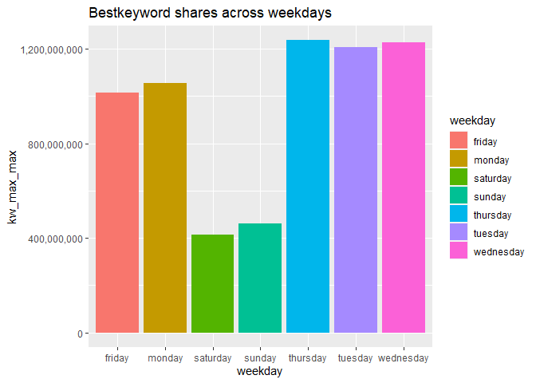
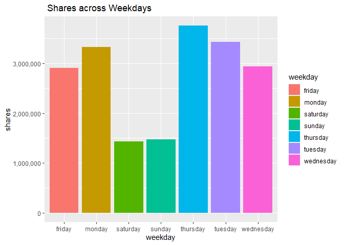

Project 2
================
Ipsita Datta & Victoria Seng
10/15/2021

# Predicting News Article Popularity

## Introduction

This data set contains a selection of news articles in six different
channels, along with attributes about those articles. Our goal is to fit
and test the best model using the variables provided to predict the
response, number of shares, for future articles.

Predictors include day of the week on which the article was published,
keywords in the title and body, videos and images in the article,
polarity (positive and negative) of the title and content, and more.

We will do some exploratory analysis of the variables and fit four
models: two linear regression models, and two ensemble tree-based
models, a random forest and a boosted tree.

### Links to Channel Reports

-   [Business](data_channel_is_bus.md)
-   [Entertainment](data_channel_is_entertainment.md)
-   [Lifestyle](data_channel_is_lifestyle.md)
-   [Social Media](data_channel_is_socmed.md)
-   [Technology](data_channel_is_tech.md)
-   [World News](data_channel_is_world.md)

### Libraries

## Data

First, we import the news popularity data csv. We’ll also pull the
channel names for later use.

``` r
newsPop <- read_csv("./Data/OnlineNewsPopularity.csv")

channel <- newsPop %>%
  select(starts_with("data_channel_is_")) %>%
    names
```

Next, we subset the channel for use in the initial EDA and model
fitting.

``` r
newsTP <- newsPop %>%
  pivot_longer(starts_with("data_channel_is_"), names_to = "chname", values_to = "v") %>%
    filter(v == TRUE) %>%
      mutate(channel = chname) %>%
        select(-chname, -v) 
```

``` r
subNews <- newsTP %>%
  filter(channel == params$channel) %>%
    select(-starts_with("data_channel_is_"), -url, -timedelta, -channel)
```

## Summaries

For the first few summaries, we will use this transposed data that turns
the binary weekday variables into one categorical variable.

``` r
TP <- subNews %>%
  pivot_longer(starts_with("weekday_is"), names_to = "wd", values_to = "wdVal") %>%
    filter(wdVal == TRUE) %>%
      mutate(weekday = substr(wd, 12, nchar(wd))) %>%
        select(-wd, -wdVal) 
```

This contingency table shows the overall number of shares by weekday. A
higher number means more shares have happened on that day.

``` r
GDAtools::wtable(TP$weekday, w = TP$shares)
```

    ##    friday    monday  saturday    sunday  thursday   tuesday wednesday       Sum 
    ##   3017254   3484532   1898113   1558532   3595351   4250146   4765065  22568993

Here is the contingency table for best keywords shares by weekdays

``` r
GDAtools::wtable(TP$weekday, w = TP$kw_max_max)
```

    ##     friday     monday   saturday     sunday   thursday    tuesday  wednesday        Sum 
    ##  729729000  894390200  388917900  289373000  970786200 1106473400 1034661100 5414330800

Here is contingency table for the number of maximum shares of an article
that was linked in the article by weekday

``` r
GDAtools::wtable(TP$weekday, w = TP$self_reference_max_shares)
```

    ##    friday    monday  saturday    sunday  thursday   tuesday wednesday       Sum 
    ##  12893028  14566604   6518810   3823255  16575589  14275152  17932814  86585252

Here are some summary stats by weekday. Again, bigger means more shares.

``` r
TP %>%
  group_by(weekday) %>%
    summarize(min = min(shares), mean = mean(shares), median = median(shares), iqr = IQR(shares), max = max(shares))
```

    ## # A tibble: 7 x 6
    ##   weekday     min  mean median   iqr    max
    ##   <chr>     <dbl> <dbl>  <dbl> <dbl>  <dbl>
    ## 1 friday       82 3051.   1800  1800 104100
    ## 2 monday      192 2821.   1600  1900  51000
    ## 3 saturday    119 3615.   2300  2200  96100
    ## 4 sunday      206 3936.   2400  2500  83300
    ## 5 thursday     86 2745.   1600  1775  55200
    ## 6 tuesday     104 2883.   1600  1700  88500
    ## 7 wednesday    36 3363.   1600  1900 663600

A higher number means more best keywords tend to be shared more often by
weekday

``` r
TP %>%
  group_by(weekday) %>%
    summarize(min = min(kw_max_max), mean = mean(kw_max_max), median = median(kw_max_max), stddev=sd(kw_max_max),iqr = IQR(kw_max_max), max = max(kw_max_max))
```

    ## # A tibble: 7 x 7
    ##   weekday     min    mean median  stddev    iqr    max
    ##   <chr>     <dbl>   <dbl>  <dbl>   <dbl>  <dbl>  <dbl>
    ## 1 friday    28000 737845. 843300 220641. 152900 843300
    ## 2 monday        0 724203. 843300 246950. 152900 843300
    ## 3 saturday  37400 740796  843300 214570. 152900 843300
    ## 4 sunday    37400 730740. 843300 227696. 152900 843300
    ## 5 thursday  28000 741058. 843300 225558. 152900 843300
    ## 6 tuesday   17100 750660. 843300 209374. 152900 843300
    ## 7 wednesday 17100 730177. 843300 235759. 152900 843300

Transpose newsPop data to create pie chart across all the data channels

``` r
newsPop_TP <- newsPop %>%
  pivot_longer(starts_with("data_channel_is_"), names_to = "dc", values_to = "dcVal") %>%
    filter(dcVal == TRUE) %>%
      mutate(datachannel = substr(dc, 17, nchar(dc))) %>%
        select(datachannel,shares,-dc, -dcVal) 
```

Here is the pie chart showing overall which datachannel is doing best

``` r
df<-newsPop_TP %>% group_by(datachannel) %>% summarise_each(funs(sum))
pct <- round(df$shares/sum(df$shares)*100)
lbls <- paste(df$datachannel, pct) # add percents to labels
lbs<-paste(lbls,"%",sep="")
pie3D(df$shares,labels=lbs,explode=0.1,
   main="Pie Chart of Shares across datachannels ")
```

<!-- -->

Here is the bar plot showing best keyword shares by weekdays. Higher
means for best keyword shares on that day

``` r
plot1<-ggplot(TP,aes(x=weekday,y=kw_max_max,fill=weekday))
plot1+ geom_col() + 
  scale_x_discrete("weekday") + 
  ggtitle("Bestkeyword shares across weekdays")+
  scale_y_continuous(labels = scales::comma)
```

<!-- -->

Here is bar graph shows number of shares by weekdays.

``` r
plot2<-ggplot(TP,aes(x=weekday,y=shares,fill=weekday))
plot2+ geom_col() + 
  scale_x_discrete("weekday") + 
  ggtitle(" Shares across Weekdays")+
  scale_y_continuous(labels = scales::comma)
```

<!-- -->

Here is a boxplot with jitter of shares by weekend status. The lines on
the box plot show quartile values by weekend status.

``` r
g <- ggplot(data = subNews, aes(x = as_factor(is_weekend), y = shares, group = as_factor(is_weekend)))
g + geom_jitter(aes(color = as_factor(is_weekend))) +
  geom_boxplot() +
      labs(x = "Weekend Status (1 = Weekend, 0 = Weekday)", 
           y = "Number of Shares", 
           title = "Box Plot with Jitter of Shares by Weekend Status") +
        scale_y_continuous(labels = scales::comma, expand = expansion(mult = c(0,0)))
```

<!-- -->

Here is a scatter plot of shares vs positive word rate with a grouping
on weekday/weekend. The Y axis represents shares. More points higher on
the Y axis on the lefthand side of the graph indicate less positive
articles getting more shares. More points higher on the Y axis on the
righthand side of the graph indicate more positive articles getting more
shares. The prevelence of one color over another in any part of the
graph is indicative of whether the article was published on a weekday or
a weekend.

``` r
g <- ggplot(data = subNews, aes(rate_positive_words, shares))
g + geom_point(aes(color = as_factor(is_weekend)), position = "jitter") + 
  labs(x = "Rate Positive Words", 
       y = "Number of Shares", 
       title = "Positive Word Rate vs Number of Shares by Weekday Status",
       color = "Weekend? (1 = Yes, 0 = No)") + 
    scale_y_continuous(labels = scales::comma)
```

<!-- -->

Here is the scatterplot showing number of images vs shares. From the
graph , we can say less number of images have more shares. Specifically
those articles has zero or one image.

``` r
g <- ggplot(data = subNews, aes(num_imgs, shares))
g + geom_point( position = "jitter") + 
  labs(x = "Number ofimages", 
       y = "Number of Shares", 
       title = "Number of images vs Number of Shares "
       ) + 
    scale_y_continuous(labels = scales::comma)
```

<!-- -->

Here is a scatter plot of shares vs negative word rate with a grouping
on weekday/weekend. The Y axis represents shares. More points higher on
the Y axis on the lefthand side of the graph indicate less negative
articles getting more shares. Less points higher on the Y axis on the
righthand side of the graph indicate more negative articles getting less
shares. The prevelence of one color over another in any part of the
graph is indicative of whether the article was published on a weekday or
a weekend.

``` r
g1 <- ggplot(data = subNews, aes(rate_negative_words, shares))
g1 + geom_point(aes(color = as_factor(is_weekend)), position = "jitter") + 
  labs(x = "Negative words rate", 
       y = "Number of Shares", 
       title = "Negative words rate vs Number of Shares by Weekend Status",
       color = "Weekend? (1 = Yes, 0 = No)") + 
    scale_y_continuous(labels = scales::comma) 
```

<!-- -->

Here is the scatter plot showing points in the middle has more share as
a function of number of words in the title. On Left of the graph with
less word in the title has less share by weekdays

``` r
g2 <- ggplot(data = subNews, aes(n_tokens_title, shares))
g2 + geom_point(aes(color = as_factor(is_weekend)), position = "jitter") + 
  labs(x = "Number of words in the title", 
       y = "Number of Shares", 
       title = "Number of words in the title vs Number of Shares by Weekend Status",
       color = "Weekend? (1 = Yes, 0 = No)") + 
    scale_y_continuous(labels = scales::comma) 
```

<!-- -->

This correlation plot visually shows the positive or negative
correlation coefficient between the various predictor varibles. The
larger the circle and more saturated the color, the stronger the
correlation. Blue is negative, and red is positive.

``` r
c <- cor(subNews %>% select(-shares))
cp <- corrplot(c, order = 'AOE', cl.pos = 'n', tl.cex = 0.5)
```

<!-- -->

## Model Fitting

A linear regression model describes the relationship between a dependent
variable and one or more independent variables, i.e y=beta0+beta1 \*
x1+beta2 \* x2 +….+betan \* xn where y is dependent response variable
and x1 to xn are independent variable (also called predictors)

Linear models are a way of describing a response variable in terms of a
linear combination of predictor variables.

### First Linear Model

splitting data in train(70%) and test (30%)

``` r
Index <- createDataPartition(y = subNews$shares , p= 0.7, list = FALSE)
Train <- subNews[Index,]
Test <- subNews[-Index,]
```

Based on the p-values and correlation coefficients, the predictors are
added to the model to predict shares.

``` r
lmfit<-train(shares ~ num_hrefs+kw_max_avg+weekday_is_saturday+weekday_is_sunday+
title_subjectivity+global_sentiment_polarity+LDA_01+LDA_04+rate_positive_words+num_imgs+num_videos,
data = Train, 
method = "lm", 
preProcess = c("center", "scale"),
trControl = trainControl(method = "cv", number = 10))
```

Performance on Test data set for Linear Regression model

``` r
pred <- predict(lmfit, newdata =Test)
lm_Test<-round(postResample(pred, obs = Test$shares),4)
round(postResample(pred, obs = Test$shares),4)
```

    ##      RMSE  Rsquared       MAE 
    ## 14906.899     0.006  2497.126

### Second Linear Model

This linear regression model chooses its predictors based on excluding
any variable that has a correlation coefficient of above 0.3 or below
-0.3 with any other variable. This should choose variables for each
channel.

``` r
cTib <- as_tibble(c) %>%
  mutate(v1 = names(as_tibble(c))) %>%
    pivot_longer(cols = !v1, names_to = "v2", values_to = "corr") %>%
      filter(abs(corr) > 0.3 & v1 != v2)

exclude <- distinct(cTib, v1) %>% 
  unlist() %>% 
    unname()

vChan <- subNews %>%
  select(-all_of(exclude))

vIndex <- createDataPartition(y =vChan$shares , p= 0.7, list = FALSE)
vTrain <- vChan[vIndex,]
vTest <- vChan[-vIndex,]
```

This is the model. It is pre-processed with centering and scaling and it
uses 10-fold CV. The variables involved may vary from channel to channel
as described above.

``` r
vMod <- train(
  shares ~ .,
  data = vTrain,
  method = "lm",
  preProcess = c("center","scale"),
  trControl = trainControl(method = "cv", number = 10)
)

vPred <- predict(vMod, newdata = vTest)
v_linreg<-round(postResample(vPred, obs = vTest$shares), 4)
round(postResample(vPred, obs = vTest$shares), 4)
```

    ##       RMSE   Rsquared        MAE 
    ## 14716.1192     0.0005  2494.3640

### Random Forest model

A random forest model is a supervised learning algorithm which extend
the idea of bagging method to solve regression or classification
problems. It creates multiple trees from bootstrap samples like as
bagging method and then use a random subset of predictors for each
bootstrap sample/tree fit. It doesn’t use all the predictor.

``` r
randomforestFit <- train(
      shares ~ .,
      data = Train,
      method = "rf",
      preProcess = c("center", "scale"),
      trControl = trainControl(method = "repeatedcv", number = 5, repeats = 3),
      tuneGrid = data.frame(mtry = seq(1,10,1)))
```

Performance on Test data set for Randomforest model

``` r
pred <- predict(randomforestFit, newdata =Test)
rf_test<-round(postResample(pred, obs = Test$shares),4)
round(postResample(pred, obs = Test$shares),4)
```

    ##       RMSE   Rsquared        MAE 
    ## 15007.8379     0.0007  2991.1611

### Boosted tree model

The boosted tree model slowly trains a model by sequentially growing
trees. As trees grow, or are modified from original data, predictions
update. For this boosted tree model, I allowed the train function to
select the theta, B, and d paramaters.

``` r
vBoost <- train(
  shares ~ ., 
  data = Train,
  method = "gbm",
  preProcess = c("center", "scale"),
  trControl = trainControl(method = "repeatedcv", number = 5, repeats = 3)
)
```

Trying out the boosted tree model on the test data.

``` r
pr <- predict(vBoost, newdata = Test)
boostTest <-round(postResample(pr, obs = Test$shares), 4)
round(postResample(pr, obs = Test$shares), 4)
```

    ##       RMSE   Rsquared        MAE 
    ## 14883.6714     0.0097  2430.3116

## Comparison

Here we read in and analyze an online news popularity data set, we are
trying to predict the number of shares of a news article .We have
created different report based on the data channels of the news article
.We used four method to compare which model works best or will be a good
fit to predict the number of shares for future articles to
published.Therefore,we are comparing four model with respect to their
RMSE. Model with lowest RMSE works best.

``` r
tab<-data.frame(Models=c('LM1','LM2','RandomForest','Boosted'),
               RMSE=round(c(lm_Test[1],v_linreg[1],rf_test[1],boostTest[1]),1))

winner<-tab %>% slice_min(RMSE,n=1)
# Models with their RMSE
tab
```

    ##         Models    RMSE
    ## 1          LM1 14906.9
    ## 2          LM2 14716.1
    ## 3 RandomForest 15007.8
    ## 4      Boosted 14883.7

For this channel winner model is LM2, 1.47161^{4} .

## Automation

The render code is run from readme\_render\_p2.R

Here is the un-evaluated render code:

``` r
## The render code to output the .md files

library(tidyverse)

newsPop <- read_csv("./Data/OnlineNewsPopularity.csv")

channel <- newsPop %>%
  select(starts_with("data_channel_is_")) %>%
  names

out <- paste0(channel, ".md")
params <- lapply(channel, FUN = function(x){list(channel = x)})

docs <- tibble(out, params)

apply(
  docs, 
  MARGIN = 1, 
  FUN = function(x){
    rmarkdown::render(input = "./README.Rmd", 
                      output_file = x[[1]], 
                      output_format = "github_document",
                      output_dir = "./", 
                      output_options = list(
                        toc = FALSE, 
                        html_preview = FALSE, 
                        keep_html = FALSE
                      ),
                      params = x[[2]]
    )
  }
)
```
